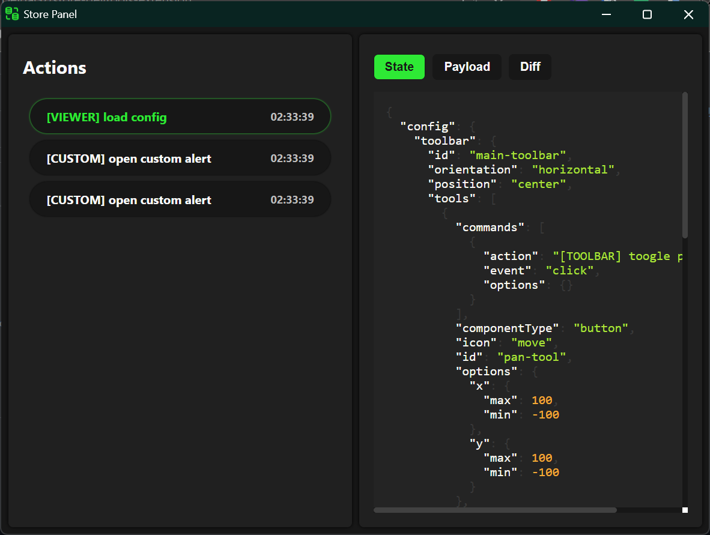
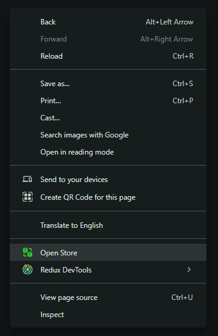

<h1 align="center">
  <br>
  
  <br>
  <br>
   Store Devtools Extension
</h1>

<div align="center">
  
  
  
</div>

<br>


 <table>
  <tr>
    <td></td>
    <td></td> 
  </tr>
</table>

Chrome Extension to inspect the Custom Store Actions through a panel that can be easily accessed from the context menu.

<details open="open">
<summary > <h2 style="display:inline-block">📖 Table of Contents</h2>  </summary>

- 📋 [Requirements](#requirements)
- 🔄 [Installation](#installation)
- 🚀 [Run](#run)

</details>

## <a name="requirements"></a> 📋 Requirements

- Chrome Version 127.0.6533.72 (Official Build) (64-bit)
- Emit the Store actions using the folwing syntax:

```javascript
    try {
      const customEvent = new CustomEvent('store-data', {
        detail: { actionId, payload, state },
      });
      document.dispatchEvent(customEvent);
    } catch (e) {
      // Handle the error
    }
```
> [!NOTE]  
> Where `actionId` is the action identification, `payload` is the data passed to execute the action and `state` is the mutatated state of the store.

> [!IMPORTANT]  
> The extension is only available for `http://localhost/*` domains, however, you can access to other domains by defining them in the [manifest.json](./manifest.json) file.

## <a name="installation"></a> 🔄 Installation

1. Clone the repository

- ssh

```bash
git@github.com:DevJaGz/store-devtools-extension.git
```

- https

```bash
https://github.com/DevJaGz/store-devtools-extension.git
```

- Github CLI

```bash
gh repo clone DevJaGz/store-devtools-extension
```

2. Open Chrome and go to `chrome://extensions`.

3. Enable Developer Mode.

4. Click on `Load unpacked` and select the `store-devtools-extension` folder.


## <a name="run"></a> 🚀 Run

You can run the store by following any of these steps:

- Open the Store Devtool and click on the `Store` tab.
- Right-click to open the context menu, then select `Open Store`.
- Click on the extension `icon button` .

